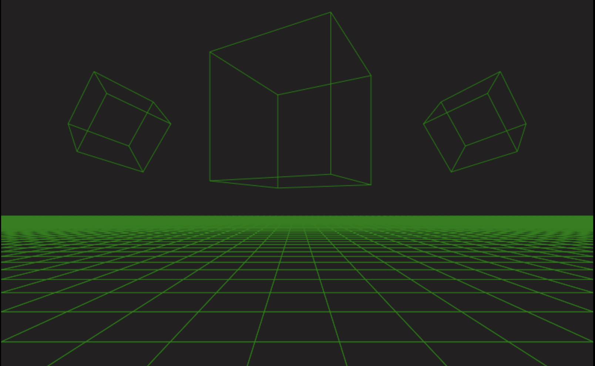

# JavaScript 3D Engine • from scratch

[Live demo](https://vitekdobrovsky.github.io/3d-engine.js/)

A hobby project to understand the inner workings of 3D graphics.

Built with no libraries — just a 2D canvas and math.



## Demo

```bash
npx serve .
# or
python3 -m http.server
```

Controls: `WASD` to move, `↑ ↓` to go up/down.

## Features

- Software rasterizer — Canvas 2D API only, zero dependencies
- Full MVP matrix pipeline: Model × View × Projection
- Perspective projection with correct perspective divide (`÷w`)
- WASD + arrow key free-fly camera
- `CubeElement` and `SquareElement` primitives with edge rendering
- 60 fps animation loop with per-frame callbacks

More technical details in [dev-notes.md](./dev-notes.md).
